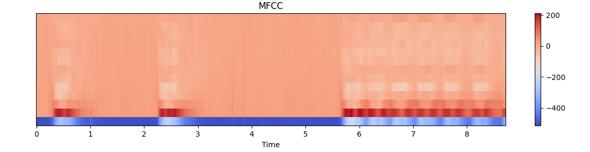

# sound_classification_with_cnn

## 📝 Project Overview
Environmental sound classification is an important task in various applications such as smart cities, surveillance, and noise pollution monitoring.  
This project demonstrates how audio data can be processed and classified into different urban sound categories by leveraging CNN architectures on MFCC features.

##  📁 Dataset
The model is trained and evaluated on the UrbanSound8K dataset, which contains 8732 labeled sound excerpts of urban sounds organized into 10 classes. 

UrbanSound8K/  
├── fold1/  
│   ├── 101415-3-0-2.wav  
│   ├── 101415-3-0-3.wav  
│   └── ...  
├── fold2/  
│   ├── 100652-3-0-0.wav  
│   ├── 100652-3-0-1.wav  
│   └── ...  
...  
├── fold10/  
│   ├── 100648-1-0-0.wav  
│   ├── 100648-1-1-0.wav  
│   └── ...  
└── UrbanSound8K.csv  

## 🎧 Sample MFCC Representation

##  📊 Results

The CNN model achieves around 80% validation accuracy after a few epochs.

